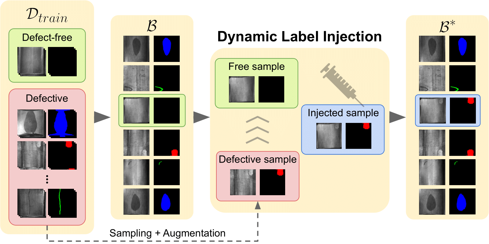

# Dynamic Label Injection for Imbalanced Industrial Defect Segmentation (ECCV Workshop 2024)

This is the official implementation of the paper [**Dynamic Label Injection for Imbalanced Industrial Defect Segmentation**]().

<p align="center">
  
</p> 

## Installation

Create your environment (Conda or Venv) and install the requirements with the following command:
```bash
pip install -r requirements.txt
```

## Create MT dataset splits 

```bash
python src/dsets/MT_gen_split.py --seed 42
                                 --dset_csv ./data/MT_dset/MT_dset.csv
                                 --output_dir ./data/MT_dset/splits
```

## Launch training

```bash
python train.py --seed 42
                --config ./configs/MT/hyp.yaml 
                --model [timm-resnest50d,resnet18,mobileone_s1]
                --method [baseline,focal,balanced,wce,dli-cp,dli-p,dli-hh]
                --dli # use it when launching one of dli
                --poisson_prob [0,0.5,1.0] # 0.5 with dli-hh, 1.0 with dli-p, 0 otherwise
                --data_perc [0.1,0.25,0.5,0.75,1.0] # percentage of data in the training set
                --log_every 1 # saving weights after log_every epochs
```

## Citation

Please cite with the following BibTeX:

```
@inproceedings{poppi2024removing,
  title={Dynamic Label Injection for Imbalanced Industrial Defect Segmentation},
  author={Caruso, Emanuele and Pelosin, Francesco and Simoni, Alessandro and Boschetti, Marco},
  booktitle={Proceedings of the European Conference on Computer Vision Workshop},
  year={2024}
}
```
